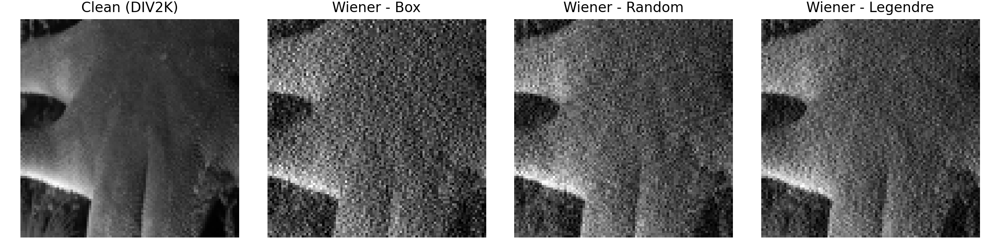

# Wiener Baseline Report

## Experimental Setup
- **Dataset**: DIV2K_train_LR_bicubic/X2, resized to 256×256 with RGB processing (`--image-mode rgb`) and the full 800-image training split (`--limit 0`).
- **Forward model**: Patterns = [`box`, `random`, `legendre`], taps `T = 31`, blur length `15 px`, duty cycle `0.5`, photon budget `1000`, read-noise `0.01`, random seed `0`.
- **Wiener parameters**: global constant `k = 1e-3` applied identically to every exposure pattern.
- **Command**:
  ```bash
  python -m mtf_aware_deblurring.pipelines.reconstruct \
    --div2k-root data \
    --subset train --degradation bicubic --scale X2 \
    --image-mode rgb --limit 0 \
    --auto-download --wiener-k 1e-3 --collect-only
  ```
  (Use `--save-recon` without `--collect-only` if you need per-image reconstructions.)
- Outputs land in `src/mtf_aware_deblurring/forward_model_outputs/reconstruction/wiener/` (CSV plus optional per-image folders).

## Qualitative Crops

*Crops (96x96 px) centered on `0001x2.png`: clean DIV2K frame and Wiener reconstructions for box, random, and Legendre codes.*

## Quantitative Summary
Per-image PSNR values (all 800 frames × 3 patterns) are stored in `forward_model_outputs/reconstruction/wiener/wiener_psnr.csv`. Aggregated results:

| Pattern | Mean PSNR (dB) | Samples |
|---------|----------------|---------|
| box     | 13.35          | 800     |
| random  | 16.77          | 800     |
| legendre| 17.14          | 800     |

These averages will serve as the classical Wiener baseline for future ADMM / physics-aware comparisons. Re-run the command with different noise parameters or `--wiener-k` to explore sensitivity curves.
